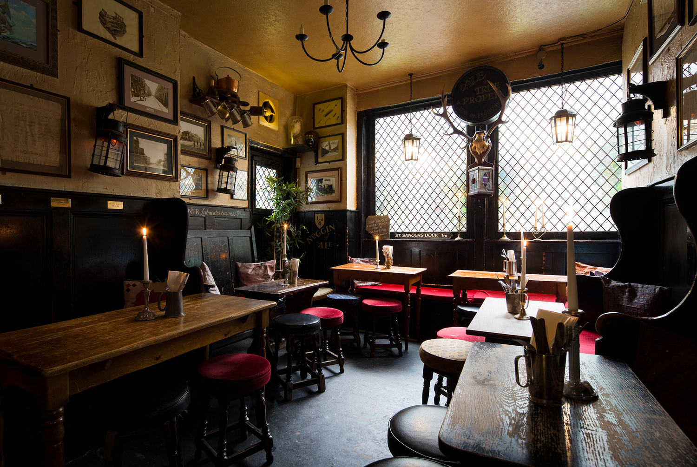

Your coat is back in circulation. Your disposable income sends its apologies.

# The Tip
## Dojo’s London weekend • Friday 16–Sunday 18 October 2026

You’ve reached the bit of October when putting on a jumper feels like having a personality. London, inconveniently, has other plans: the film festival reaches its final weekend, and Frieze-week activity spills into galleries beyond the expensive-trouser district. You can inspect distorted architecture in Peckham, dance without paying admission, or let somebody considerably more qualified handle dinner. Below: eleven reasons to leave the flat, with enough cheap options to stop your banking app becoming a fucking horror film. ([bfi.org.uk](https://www.bfi.org.uk/london-film-festival/news/screen-talks-programme-70th-bfi-london-film-festival?utm_source=openai))

## Some events for doing

### 1. Monika Sosnowska: Weight of Matter
**South London Gallery, Peckham**

Your shelving disaster finally has artistic company. Sosnowska suspends enormous industrial sculptures from the rafters and turns architectural forms gloriously wrong across two buildings. Pick this for a substantial art outing without a substantial financial incident.

**Fri–Sun, 11am–6pm this weekend.** 65–67 and 82 Peckham Road. **Free, no booking required.** [Get bent, aesthetically.](https://www.southlondongallery.org/exhibitions/monika-sosnowska-weight-of-matter/) ([southlondongallery.org](https://www.southlondongallery.org/exhibitions/monika-sosnowska-weight-of-matter/))

### 2. Jenkin van Zyl: Enclosure
**Somerset House, Strand**

Fancy becoming somebody else? This film and immersive installation imagines a decrepit facility where tourists borrow other lives. Fairground signage, office debris, and sinister doubles make it our pick for an early Halloween shiver without novelty cobwebs.

**Fri–Sat, noon–7pm. Sun, 10am–6pm.** Lancaster Rooms, New Wing. Last entry one hour before closing. **Free, booking offered.** Unsuitable for ages 12 and under. [Meet your considerably worse half.](https://www.somersethouse.org.uk/whats-on/jenkin-van-zyl-enclosure) ([somersethouse.org.uk](https://www.somersethouse.org.uk/whats-on/jenkin-van-zyl-enclosure))

### 3. Much Ado About Nothing
**Shakespeare’s Globe, Bankside**

Before you send another forensic screenshot to the group chat, watch Beatrice and Benedick weaponise conversation properly. Chelsea Walker directs Shakespeare’s romantic scrap. A strong choice for cheap theatre, provided your knees fancy joining the standing cast.

**Fri, 2pm. Sat, 2pm and 7.30pm.** 21 New Globe Walk. **£5 and £10 standing tickets listed.** Saturday’s matinee is relaxed. [Get thee some better banter.](https://www.shakespearesglobe.com/whats-on/much-ado-about-nothing/) ([shakespearesglobe.com](https://www.shakespearesglobe.com/whats-on/much-ado-about-nothing/))

## Some nights worth putting trousers on for

### 4. Wolf Eyes + CUNTROACHES
**Cafe OTO, Dalston**

Your inbox has been making a horrible noise all week. Try the professionally interesting version: Michigan experimentalists Wolf Eyes meet Berlin noise-punk trio CUNTROACHES. Go for industrial abrasion, not a soothing soundtrack to discussing your kitchen extension.

**Fri 16, 7.30pm.** 18–22 Ashwin Street. **Venue lists £20 via DICE, £22 otherwise.** [Let the racket answer your emails.](https://www.cafeoto.co.uk/events/ute-wolf-eyes-cuntroaches-2/) ([cafeoto.co.uk](https://www.cafeoto.co.uk/events/ute-wolf-eyes-cuntroaches-2/))

### 5. 3 Evenings: Saturday
**Wapping Hydraulic Power Station**

Robotic theatre, live animation, and choreography occupy an industrial setting with rather more presence than your living room. Holly Blakey and Tai Shani collaborate, while Team Rolfes bring audience-powered chaos. Our pick for properly ambitious Saturday-night weirdness.

**Sat 17, 6.30–10.30pm.** Wapping Hydraulic Power Station, E1W 3SF, **not Somerset House**. **£25, £20 concessions. 18+.** Saturday booking is linked separately from the sold-out weekend pass. [Give your Saturday a software fault.](https://www.somersethouse.org.uk/whats-on/3-evenings-saturday) ([somersethouse.org.uk](https://www.somersethouse.org.uk/whats-on/3-evenings-saturday))

### 6. How Does It Feel To Be Loved?
**Signature Brew Haggerston**

Your cardigan deserves a night out. This Belle & Sebastian special folds hits and deep cuts into indie pop and soul, with no requirement to dance convincingly. Choose it for affectionate musical wallowing rather than bottle-service bollocks.

**Sat 17, 9pm–2am.** 340 Acton Mews. **£6.60 advance including booking fee, £7 door. 18+.** Advance tickets available when checked. [Release your inner sensitive little disco animal.](https://wegottickets.com/event/688940) ([howdoesitfeel.co.uk](https://www.howdoesitfeel.co.uk/hdifnight.html))

### 7. 7 Miles Out: Journey to The Haçienda
**BFI Southbank**

Cinema culture needn’t mean sitting still and pretending you understood the ending. DJ Terry T-Rex supplies acid house, Balearic sounds, and indie dance for this film-festival party. The clincher: your entrance costs precisely nothing.

**Fri 16, 9pm–1am.** BFI Bar, BFI Southbank. **Free, 18+, no booking.** First come, first served, subject to capacity. [Put your critical faculties in your dancing shoes.](https://whatson.bfi.org.uk/lff/Online/default.asp?BOparam%3A%3AWScontent%3A%3AloadArticle%3A%3Apermalink=seven-miles-out-dj-night-lff26) ([whatson.bfi.org.uk](https://whatson.bfi.org.uk/lff/Online/default.asp?BOparam%3A%3AWScontent%3A%3AloadArticle%3A%3Apermalink=seven-miles-out-dj-night-lff26))

## Stuff to eat, drink, and pretend is educational

### 8. London Craft Chocolate Fair
**Fidelio Cafe, Farringdon**

Upgrade your emergency desk chocolate into an actual outing. Cocoa Runners gathers makers including Pump Street, Chocolarder, and Bare Bones for a weekend market. A pleasingly affordable entry point, although your subsequent bar-buying behaviour is between you and your tote.

**Sat 17, 10am–6pm. Sun 18, 10am–5pm.** Fidelio Cafe, Clerkenwell Road. **£5 timed entry.** Talks cost extra. Walk-up entry is also offered, with possible queuing. [Develop a highly specific cocoa problem.](https://cocoarunners.com/event/craft-chocolate-fair-entry-time-slots/) ([cocoarunners.com](https://cocoarunners.com/event/craft-chocolate-fair-entry-time-slots/))

### 9. Mushaira + Chef Yogi’s pop-up
**Cafe OTO, Dalston**

Yes, OTO again. Saturday swaps Friday’s sonic assault for poetry, a DJ, and Sri Lankan cooking. Roger Robinson and Anthony V. Capildeo feature among the readers. Choose this if dinner and intellectual stimulation usually occupy separate browser tabs.

**Sat 17, 7.30pm.** 18–22 Ashwin Street. **£10 advance, £12 door, £6 members. Meals £10–£15 extra.** The organiser asks you to book early to help kitchen planning. [Feed your head, then the rest of you.](https://www.cafeoto.co.uk/events/the87press-present-mushaira-oct-26/) ([cafeoto.co.uk](https://www.cafeoto.co.uk/events/the87press-present-mushaira-oct-26/))

## Some classics, because novelty is exhausting

### 10. Maltby Street Market
**Bermondsey**

When nobody can agree on lunch, outsource the argument to a railway arch. The current trader roster includes Amen Ethiopian, Banh Mi Nen, and La Criolla Empanadas. Your best bet here is separate orders and strictly negotiated sharing rights.

**Sat 17, 10am–5pm. Sun 18, 11am–4pm.** Ropewalk, Maltby Street, SE1 3PA. **Walk-up market, no admission ticket.** Food prices and trader attendance vary. [Resolve lunch through delicious diplomacy.](https://www.maltbystreetmarket.co.uk/traders) ([maltbystreetmarket.co.uk](https://www.maltbystreetmarket.co.uk/))

### 11. Sunday at The Mayflower
**Rotherhithe**

Give Sunday a proper landing rather than another horizontal takeaway. The Mayflower’s roast menu includes pork belly and vegetarian Wellington, while candle-lit Sundays supply evening atmosphere. Pick it for gravy, a riverside setting, and briefly forgetting Monday has your address.

**Sun 18.** 117 Rotherhithe Street. Pub opens **noon–10pm**. Current Sunday menu: **pork belly £19.50, vegetarian Wellington £18.50**. Roasts can sell out. Request a dining reservation rather than assuming a table. [Drop anchor in the gravy.](https://www.mayflowerpub.co.uk/contact) ([mayflowerpub.co.uk](https://www.mayflowerpub.co.uk/))

---

## Minted to Skinted
### The culture budget, without the creative accounting

You don’t need to spend heavily to have something better to report on Monday than “sorted a drawer”. You do need to distinguish admission from the three drinks and commemorative paperback that somehow follow it.

### Skinted: a £0 Friday programme

Book a free slot for *Enclosure* in the afternoon, then head to the BFI’s free Haçienda-inspired night at 9pm. You get moving-image art followed by actual movement. There’s a gap for dinner, and neither “free” nor “culture” means you should skip eating. BFI entry is capacity-dependent, so don’t arrive at midnight expecting the red carpet to recognise your potential. **Admission total: £0. Food, drinks, and travel extra.** ([somersethouse.org.uk](https://www.somersethouse.org.uk/whats-on/jenkin-van-zyl-enclosure))

### Modestly solvent: Shakespeare for a fiver

The Globe currently lists £5 standing tickets for the weekend’s *Much Ado* performances. Book the price you can actually see, rather than mentally spending a bargain that’s vanished. You’ll be standing for a production running about two and a half hours, including its interval. Wear comfortable shoes. Seductive footwear is less seductive when you’re silently negotiating with a calf muscle. ([shakespearesglobe.com](https://www.shakespearesglobe.com/whats-on/much-ado-about-nothing/))

### Minted-ish: let Wapping do the work

Put £25 towards Saturday’s *3 Evenings* instead. You’re paying for live collaborations, interactive installations, and an unusual venue, not merely permission to enter a room. That’s our preferred upgrade. Keep your remaining budget for getting home, rather than trying to turn one evening into an endurance sport. ([somersethouse.org.uk](https://www.somersethouse.org.uk/whats-on/3-evenings-saturday))

## Dating 101
### The gallery date that isn’t an unpaid seminar

For a low-pressure Sunday, suggest *Weight of Matter* at South London Gallery. It’s free, requires no booking, and gives you two buildings’ worth of things to look at when conversation briefly goes on annual leave. ([southlondongallery.org](https://www.southlondongallery.org/exhibitions/monika-sosnowska-weight-of-matter/))

**Set a gentle limit.** “Shall we have a look for an hour?” is an invitation. A seven-stop itinerary is a hostage situation with good typography.

**Ask what they notice.** You don’t need to identify every architectural reference. “That makes me feel oddly uneasy” starts a conversation. “Obviously this interrogates spatial hegemony” may end one.

**Let disagreement live.** You can dislike the same sculpture for completely different reasons. You can also like different things and still fancy each other. Astonishing administrative breakthrough.

**Offer the next bit, don’t prescribe it.** A coffee afterwards is an option, not a contractual extension. If the chemistry’s there, lovely. If it isn’t, you’ve seen some art without spending £90 discovering that somebody describes all their exes as “mental”.

Your objective is curiosity, not a convincing audition for a gallery wall label.

---

*Listings and published prices checked on 10 October 2026. Some booking systems do not display live ticket or table inventory publicly. Confirm your chosen slot before travelling, and check checkout totals where fees are not specified above.*
